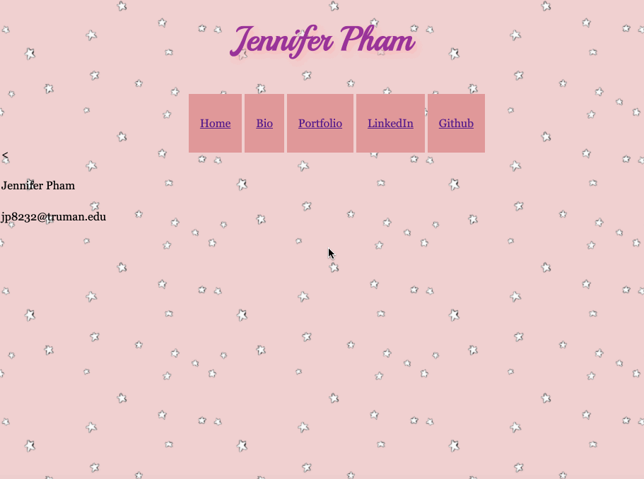

# web-work
# Web development practice
This project is to practice basic web development skills, focusing on visual coherence, using HTML and CSS.

## Video Walkthrough 

GIF created with [LiceCap](http://www.cockos.com/licecap/).

## Notes
I got to explore the basics of web development. 
This project primarily focused on how to create structure pages using HTML,
creating visually appealing pages using CSS, and learning about
the interaction between CSS and HTML.

## License

    Copyright 2020 Jennifer Pham

    Licensed under the Apache License, Version 2.0 (the "License");
    you may not use this file except in compliance with the License.
    You may obtain a copy of the License at

        http://www.apache.org/licenses/LICENSE-2.0

    Unless required by applicable law or agreed to in writing, software
    distributed under the License is distributed on an "AS IS" BASIS,
    WITHOUT WARRANTIES OR CONDITIONS OF ANY KIND, either express or implied.
    See the License for the specific language governing permissions and
    limitations under the License.
